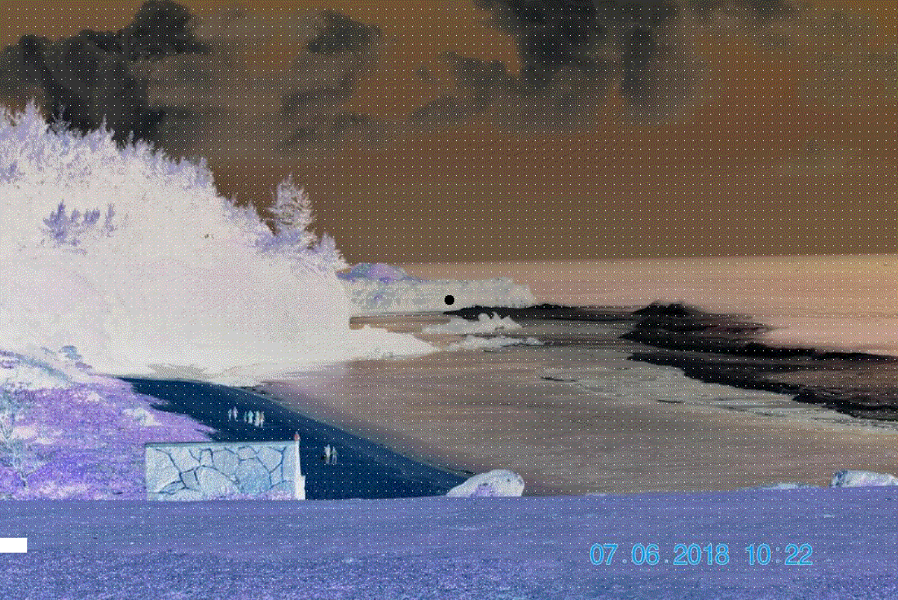
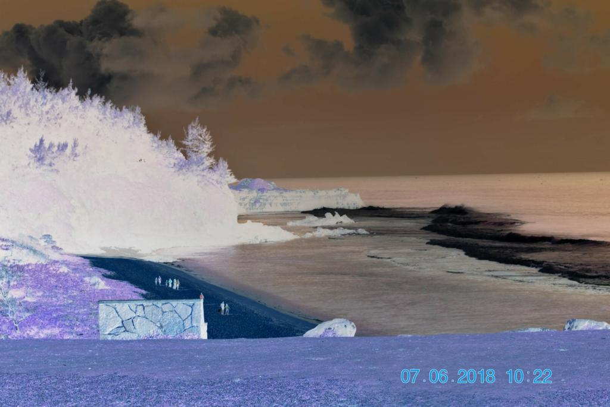

# Color Inversion Optical Illusion


As shown and well described [here](https://t3hz0r.com/post/colour-afterimage-optical-illusion-tutorial/), we noticed that an illusion is produced by consistently showing the viewer a chromatic-inverted image and suddenly flashing the image in greyscale. This gives the viewers an illusion of seeing the real image, which was never shown to them. The code adds textures to the image so that the illusion is more effective and a loading bar that self-calibrates each image's dimensions. **To use the illusion, stare at the black dot until the progress bar finishes - at which point the image should give the *perception* of being colored.**

To fully automate this process, we present a project made using PILLOW. It can be accessed in the file `main.py` to run on your system or `color_inversion_optical_illusion.ipynb` which provides an interactive method to upload files and receive the illusion.

**Click the file below to view the gif**


## Install the following dependencies to get started:
```
from PIL import Image, ImageOps, ImageDraw
```

## Step 1
Invert the colors of the image

Color inversion, as the name suggests, is the process of inverting the RGB values of an image, an array of pixels.
```
If:
1. Value of initial Red = X
2. Value of initial Blue = Y
3. Value of initial Green = Z

Then:
1. Value of final Red = 255-X
2. Value of final Blue = 255-Y
3. Value of final Green = 255-Z
```
```
inverted = ImageOps.invert(img)
```


## Step 2
Convert the image to greyscale
```
imgGray = img.convert('L')
```


## Step 3
Add the loading bar and concatenate inverted the greyscale images!

